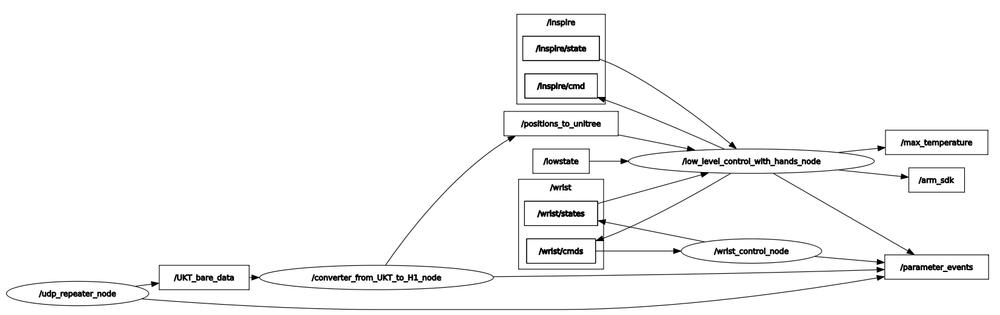
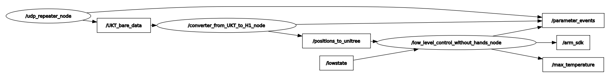

# unitree_h1_meta_launch_ws
В данном репозитории лежат ROS2-пакеты, содеражащие launch-файлы, которые позволяют запустить готовые сконфигурированные системы, состоящие из наборов нод других репозиториев.

# Оглавление

1. [📦 Содержание Репозитория](#-содержание-репозитория)
2. [🚀 Быстрый Старт](#-быстрый-старт)
3. [📂 Какие репозитории установить](#-какие-репозитории-установить)
   - 3.1 [Соло-скрипты](#соло-скрипты)
   - 3.2 [Мульти-скрипты](#мульти-скрипты)
4. [⚙️ Предварительные Требования](#️-предварительные-требования)
5. [🧪 Использование](#-использование)
   - 5.1 [Запуск Launch файлов](#запуск-launch-файлов)
1. [🗺️ Архитектура](#️-архитектура)
   - 6.1 [teleoperation_with_hands_launch](#teleoperation_with_hands_launch)
   - 6.2 [teleoperation_without_hands_launch](#teleoperation_without_hands_launch)
7. [Лицензия](#лицензия)
8. [Предложения и корректировки](#предложения-и-корректировки)

## 📦 Содержание репозитория
*   **`docs/`**: Дополнительная документация.
*   **`fast_install/`**: Содержит скрипты для быстрой установки зависимостей.
* **`meta_launch_package/`**: Содержит launch-файлы, которые запускают launch-файлы из других модулей-репозиториев.
	-  `teleoperation_with_hands_launch.py`: launch-файл для запуска телеуправления роботом Unitree H1 в комплектации ***с кистями***.
	- `teleoperation_without_hands_launch.py`: launch-файл для запуска телеуправления роботом Unitree H1 в комплектации ***без кистей***.
*   **`README.md`**: Этот файл.
*   **`save.bash`**: Скрипт для быстрой выгрузки на Github.
*   **`LICENSE`**: Лицензия, под которой распространяется данное программное обеспечение

## 🚀 Быстрый Старт
Пошаговая инструкция для **быстрого** запуска основной функциональности. Предполагаем, что ROS2 уже установлен.
1.  **Клонировать репозиторий** в `src` вашего workspace:
```bash
mkdir -p unitree_h1_meta_launch_ws/src
cd unitree_h1_meta_launch_ws/src
git clone https://github.com/cyberbanana777/unitree_h1_meta_launch_ws.git .
```
2.  **Собрать текущий workspace:**
```bash
cd ..
colcon build
source install/setup.bash  # Или setup.zsh - в зависимости от вашего интерпретатора командной строки
```
3. **В зависимости от цели (см. пункт ниже), которую Вы хотите решить, установите необходимые репозитории (инструкция находится внутри репозитория)**.
4. Добавить `source` в `~/.bashrc`:
Зачем? - Чтобы не делать при каждом перезапуске терминала `source install/setup.bash`. Скрипт генерирует строчку для автоматизации этого процесса.
```bash
line_to_add="source \"$(pwd)/install/setup.bash\""
grep -qxF "$line_to_add" ~/.bashrc || echo "$line_to_add" >> ~/.bashrc
```
5. **Пример запуска**
```bash
ros2 launch meta_launch_package teleoperation_with_hands_launch.py
```

## 📂 Какие репозитории установить:

|Цель|Репозитории|
|---|---|
|Телеуправление роботом Unitree H1 с помощью Устройства Копирующего Типа (УКТ) от НПО "Андроидная техника"|[unitree_h1_control_ws](https://github.com/cyberbanana777/unitree_h1_control_ws), [unitree_h1_teleoperation_ws](https://github.com/cyberbanana777/unitree_h1_teleoperation_ws)|

Для быстрой установки мы создали bash-скрипты, которые в одно движение развёртывают один или несколько репозиториев-зависимостей. 
### **Соло-скрипты**
Все скрипты, которые развёртывают один репозиторий, лежат в папке `fast_install/part_install`.
```bash
cd fast_install/part_install
```
Скрипт, который развёртывает [unitree_h1_control_ws](https://github.com/cyberbanana777/unitree_h1_control_ws)
```bash
bash install_unitree_h1_control_ws.bash
```
Скрипт, который развёртывает [unitree_h1_teleoperation_ws](https://github.com/cyberbanana777/unitree_h1_teleoperation_ws)
```bash
bash install_unitree_h1_teleoperation_ws.bash
```
### **Мульти-скрипты**
Все скрипты, которые развёртывают сразу несколько репозиториев, лежат в папке `fast_install/complex_install`.
```bash
cd complex_install/part_install
```
Скрипт, который развёртывает все зависимости для задачи телеуправления.
```bash
bash teleoperation_case.bash
```

## ⚙️ Предварительные Требования
Что нужно для шагов "Быстрого Старта":
*   **Поддерживаемые версии ROS2:** Foxy
*   **Поддерживаемые платформы:** Ubuntu 20.04

## 🧪 Использование
Как пользоваться пакетами после установки и сборки.
### **Запуск Launch файлов:**

| Цель                                                                                                      | Описание                                                                       | Команда                                                                  |
| --------------------------------------------------------------------------------------------------------- | ------------------------------------------------------------------------------ | ------------------------------------------------------------------------ |
| Телеуправление роботом Unitree H1 с помощью Устройства Копирующего Типа (УКТ) от НПО "Андроидная техника" | Телеуправление роботом Unitree H1 в комплектации **с кистями** с помощью УКТ.  | <br>`ros2 launch meta_launch_package teleoperation_with_hands_launch.py` |
| Телеуправление роботом Unitree H1 с помощью Устройства Копирующего Типа (УКТ) от НПО "Андроидная техника" | Телеуправление роботом Unitree H1 в комплектации **без кистей** с помощью УКТ. | `ros2 launch meta_launch_package teleoperation_without_hands_launch.py`  |
|                                                                                                           |                                                                                |                                                                          |

## 🗺️ Архитектура
Здесь представлены скрины из rqt_graph при различных запущенных сценариях.
### teleoperation_with_hands_launch

### teleoperation_without_hands_launch


## Лицензия
Copyright (c) 2025 Алиса Зенина и Александр Грачев РТУ МИРЭА (Россия)

Данное программное обеспечение распространяется под [лицензией MIT](LICENSE).  
Разрешается свободное использование, копирование, модификация и распространение при условии сохранения уведомления об авторских правах и текста лицензии.
## Предложения и корректировки
Если Вы нашли, ошибку, неточность, у Вас есть предложения по улучшению или вопросы, то напишите в телеграмм [сюда](https://t.me/Alex_19846) (Александр) или [сюда](https://t.me/Kika_01) (Алиса).