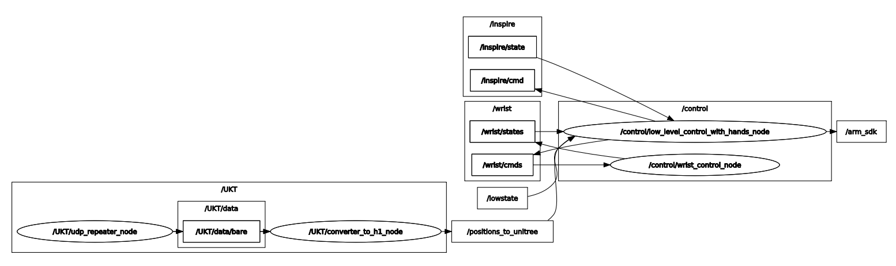
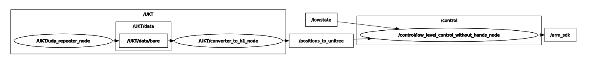
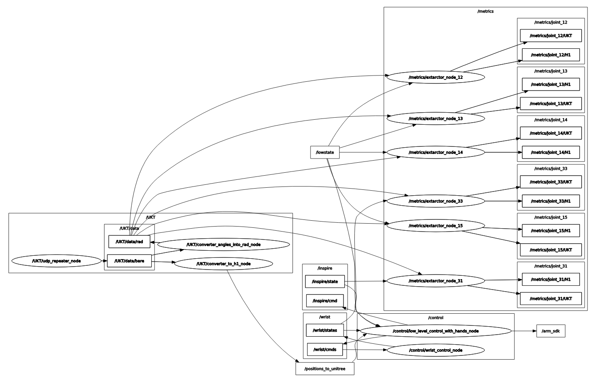
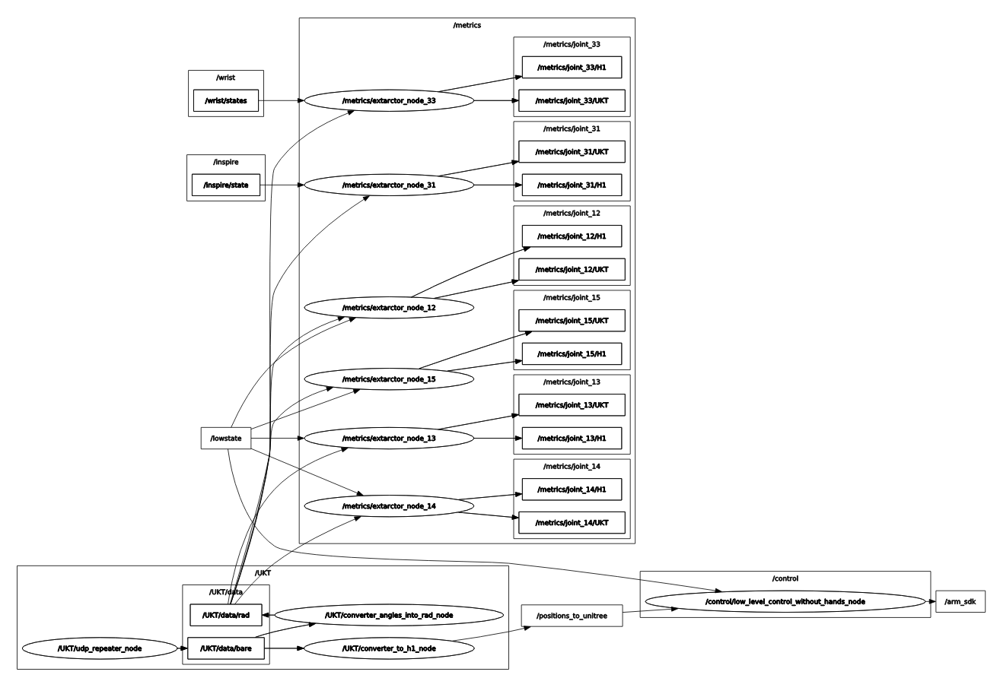

# unitree_h1_meta_launch_ws
В данном репозитории лежат ROS2-пакеты, содеражащие launch-файлы, которые позволяют запустить готовые сконфигурированные системы, состоящие из наборов нод других репозиториев.

## 📚 Оглавление

1. [📦 Содержание репозитория](#-содержание-репозитория)
2. [🚀 Быстрый старт](#-быстрый-старт)
3. [📂 Какие репозитории установить](#-какие-репозитории-установить)
   - 3.1 [Соло-скрипты](#соло-скрипты)
   - 3.2 [Мульти-скрипты](#мульти-скрипты)
4. [⚙️ Предварительные требования](#️-предварительные-требования)
5. [🧪 Использование](#-использование)
   - 5.1 [Запуск Launch файлов](#запуск-launch-файлов)
	   - [Запуск телеуправления ](#комплексный-запуск-системы-телеуправления)
	   - [Запуск воспроизведения движений](#комплексный-запуск-системы-воспроизведения-записанных-с-помощью-УКТ-движений-с-веб-интерфейсом)
6. [✨ Дополнительные возможности](#-дополнительные-возможности)
7. [🌐 RQT-grahs's](#️-rqt-grahss)
   - 7.1 [`Телеоперация`](#телеоперация)
   - 7.2 [`Web-контроль`](#web-контроль)
8. [🧐 Лицензия](#-лицензия)
9. [💡 Предложения и корректировки](#-предложения-и-корректировки)

## 📦 Содержание репозитория
* **`bash_library/`**: Содержит bash-модули, на которых строятся скрипты быстрой развёртки и доп. фичи.  
* **`docs/`**: Дополнительная документация.
*   **`fast_install/`**: Содержит скрипты устанавливающие пакеты и зависимости для различных кейсов.
* **`meta_launch_package/`**: Содержит launch-файлы, которые запускают launch-файлы из других модулей-репозиториев.
	-  `teleoperation.launch.py`: launch-файл для запуска телеуправления роботом Unitree H1 .
	- `web_face_control.launch.py`: launch-файл для запуска проигрывания движений, запуск которых осуществляется через web-страницу.
*   **`README.md`**: Этот файл.
*   **`LICENSE`**: Лицензия, под которой распространяется данное программное обеспечение

<p align="right" style="margin-top: 20px;"><a href="#-оглавление" style="text-decoration: none;">🔝 Вернуться к оглавлению</a></p>

## 🚀 Быстрый старт

‼️**Репозиторий нужно устанавливать на локальной машине и на роботе, что бы можно было использовать все установочные bash-скрипты**

Пошаговая инструкция для **быстрого** запуска основной функциональности. Предполагаем, что ROS2 уже установлен.
1.  **Клонировать репозиторий** в `src` вашего workspace:
```bash
mkdir -p unitree_h1_meta_launch_ws/src
cd unitree_h1_meta_launch_ws/src
git clone https://github.com/cyberbanana777/unitree_h1_meta_launch_ws.git .
```
2.  **Собрать текущий workspace:**
```bash
cd ..
colcon build
source install/local_setup.bash  # Или local_setup.zsh - в зависимости от вашего интерпретатора командной строки
```
3. **В зависимости от цели, которую Вы хотите решить, установите (см. пункт ниже)  необходимые репозитории с помощью bash-скрипта или самостоятельно по инструкции внутри репозитория**.
4. Добавить `source` в `~/.bashrc`:
Зачем? - Чтобы не делать при каждом перезапуске терминала `source install/local_setup.bash`. Скрипт генерирует строчку для автоматизации этого процесса.
```bash
line_to_add="source \"$(pwd)/install/local_setup.bash\""
grep -qxF "$line_to_add" ~/.bashrc || echo "$line_to_add" >> ~/.bashrc
```
5. **Пример запуска**
```bash
ros2 launch meta_launch_package teleoperation.launch.py
```
<p align="right" style="margin-top: 20px;"><a href="#-оглавление" style="text-decoration: none;">🔝 Вернуться к оглавлению</a></p>

## 📂 Какие репозитории установить:

| Цель                                                                                                      | Репозитории                                                                                                                                                                                               |
| --------------------------------------------------------------------------------------------------------- | --------------------------------------------------------------------------------------------------------------------------------------------------------------------------------------------------------- |
| Телеуправление роботом Unitree H1 с помощью Устройства Копирующего Типа (УКТ) от НПО "Андроидная техника" | [unitree_h1_control_ws](https://github.com/cyberbanana777/unitree_h1_control_ws), [unitree_h1_teleoperation_ws](https://github.com/cyberbanana777/unitree_h1_teleoperation_ws)                            |
| Проигрывание заранее записанных движений, выбор движения осуществляется через web-страницу                | [unitree_h1_control_ws](https://github.com/cyberbanana777/unitree_h1_control_ws), [unitree_h1_piont-by-point_programming](https://github.com/cyberbanana777/unitree_h1_point-by-point_programming_ws)<br> |

Для быстрой установки мы создали bash-скрипты, которые устанавливают репозитории (которые являются work_space), зависимости к ним и собирают work_space'ы.

### **Скрипты которые устанавливают все репозиотрии для выбранного кейса**
Все скрипты, которые устанавливают сразу несколько репозиториев (_ws), лежат в папке `fast_install/complex_install`.

```bash
cd fast_install/complex_install
```
Скрипт, который устанавливает все репозитории и зависимости для задачи телеуправления.
```bash
bash teleoperation_case.bash
```
Скрипт, который устанавливает все репозитории и зависимости для задачи воспроизведения движений с web-управлением.
```bash
bash web_face_case.bash
```

### **Скрипты которые устанавливают пресеты репозиториев**
Все скрипты, которые устанавливают сразу несколько репозиториев (_ws), лежат в папке `fast_install/complex_install`.

```bash
cd fast_install/complex_install
```

Скрипт, который устанавливает все репозитории запускаемые на роботе  
```bash
bash for_unitree_computer.bash
```
Скрипт, который устанавливает все репозитории запускаемые на компьютере пользователя
```bash
bash for_user_computer.bash
```
Скрипт, который устанавливает все репозитории для h1
```bash
bash full_install.bash
```
Скрипт, который устанавливает репозитории для программирования робота по точкам и визуализации
```bash
bash master_set.bash
```

<p align="right" style="margin-top: 20px;"><a href="#-оглавление" style="text-decoration: none;">🔝 Вернуться к оглавлению</a></p>

### **Скрипты которые устанавливают только один из репозиториев**
Все скрипты, которые устанавливают один репозиторий (_ws) и зависимости к нему, лежат в папке `fast_install/part_install`.
```bash
cd fast_install/part_install
```

Скрипт, который устанавливает [unitree_h1_control_ws](https://github.com/cyberbanana777/unitree_h1_control_ws)
```bash
bash install_unitree_h1_control_ws.bash
```
Скрипт, который устанавливает [unitree_h1_teleoperation_ws](https://github.com/cyberbanana777/unitree_h1_teleoperation_ws)
```bash
bash install_unitree_h1_teleoperation_ws.bash
```
Скрипт, который устанавливает [unitree_h1_point-by-point_programming_ws](https://github.com/cyberbanana777/unitree_h1_point-by-point_programming_ws)
```bash
bash install_unitree_h1_point-by-point_programming.bash
```
Скрипт, который устанавливает [unitree_h1_sensors_ws](https://github.com/cyberbanana777/unitree_h1_sensors_ws)
```bash
bash install_unitree_h1_sensors_ws.bash
```
Скрипт, который устанавливает [unitree_h1_slam_ws](https://github.com/cyberbanana777/unitree_h1_slam_ws)
```bash
bash install_unitree_h1_slam_ws.bash
```
Скрипт, который устанавливает [unitree_h1_visualization_ws](https://github.com/cyberbanana777/unitree_h1_visualization_ws)
```bash
bash install_unitree_h1_visualization_ws.bash
```

<p align="right" style="margin-top: 20px;"><a href="#-оглавление" style="text-decoration: none;">🔝 Вернуться к оглавлению</a></p>

## ⚙️ Предварительные требования
Что нужно для шагов "Быстрого Старта":
*   **Поддерживаемые версии ROS2:** Foxy
*   **Поддерживаемые платформы:** Ubuntu 20.04

<p align="right" style="margin-top: 20px;"><a href="#-оглавление" style="text-decoration: none;">🔝 Вернуться к оглавлению</a></p>

## 🧪 Использование
Как пользоваться пакетами после установки и сборки.
### **Запуск Launch файлов:**

*Примечание:*
`--show-args` - ключ, который показывает все параметры launch-файла и их возможные значения
#### **Комплексный запуск системы телеуправления:

```bash
ros2 launch meta_launch_package teleoperation.launch.py
```


**Доступные параметры запуска:**
- `mode` (по умолчанию: `"with_hands"`) - режим работы системы
- `target_topic` (по умолчанию: `"arm_sdk"`) - топик для команд управления
- `max_joint_velocity` (по умолчанию: `"4.0"`) - максимальная скорость суставов в рад/сек
- `target_action` (по умолчанию: `"teleoperation"`) - целевое действие для команд управления
- `enable_metrics` (по умолчанию: `"False"`) - включение публикации метрик угловых положений
- `joints_to_check` (по умолчанию: `"12, 13, 14, 15, 31, 33"`) - список суставов для отслеживания
- `ip` (по умолчанию: `"192.168.123.162"`) - IP адрес для чтения данных с UKT. Подробнее Вы можете прочитать [тут](https://github.com/cyberbanana777/unitree_h1_teleoperation_ws#:~:text=ip%20(%D0%BF%D0%BE%20%D1%83%D0%BC%D0%BE%D0%BB%D1%87%D0%B0%D0%BD%D0%B8%D1%8E,%D0%BF%D1%80%D0%BE%D1%87%D0%B8%D1%82%D0%B0%D1%82%D1%8C%20%D0%B7%D0%B4%D0%B5%D1%81%D1%8C.)

**Режимы работы (`mode`):**
- `with_hands` - режим с использованием рук оператора
- `without_hands` - режим без использования рук оператора

**Целевые действия для команд управления ( target_action ):**
- `teleoperation` - телеуправление т. е. ограниченные диапазоны положений моторов
-  `other` - любое другое т. е. полные диапазоны положений моторов

**Примеры запуска с параметрами:**
```bash
# Запуск в режиме с руками с настройками по умолчанию
ros2 launch meta_launch_package teleoperation.launch.py

# Запуск в режиме без рук с метриками
ros2 launch meta_launch_package teleoperation.launch.py \
  mode:=without_hands \
  enable_metrics:=True

# Запуск с кастомными настройками скорости и суставов
ros2 launch meta_launch_package teleoperation.launch.py \
  max_joint_velocity:=3.0 \
  joints_to_check:="12, 14, 23, 31" \
  enable_metrics:=True

# Запуск с указанием IP адреса и топика управления
ros2 launch meta_launch_package teleoperation.launch.py \
  ip:="192.168.1.100" \
  target_topic:="lowcmd"
```

**Запускаемые системы:**

**1. Система управления  моторами H1 (control_h1_base.launch.py):**
- Запускает соответствующие ноды управления в зависимости от выбранного режима
- Параметры: `mode`, `target_topic`, `max_joint_velocity`, `target_action`

**2. Система телеуправления (teleoperation.launch.py):**
- `repeater_package` -> `repeater_node`
- `converter_from_ukt_to_h1_package` -> `converter_from_ukt_to_h1_node`
- При `enable_metrics:=True` дополнительно:
  - `converter_angles_ukt_into_rad_package` -> `converter_angles_ukt_into_rad_node`
  - `extractor_package` -> `extractor_node_{joint}` (для каждого сустава из `joints_to_check`)

**Примечание:** Совместимость суставов сохраняется - поддерживаются суставы в диапазоне `[0; 33]`, за исключением сустава 9.

#### **Комплексный запуск системы воспроизведения записанных с помощью УКТ движений с веб-интерфейсом**

```bash
ros2 launch meta_launch_package web_face_control.launch.py
```

**Доступные параметры запуска:**
- `mode` (по умолчанию: `"with_hands"`) - режим работы системы
- `target_topic` (по умолчанию: `"arm_sdk"`) - топик для команд управления
- `max_joint_velocity` (по умолчанию: `"4.0"`) - максимальная скорость суставов
- `target_action` (по умолчанию: `"other"`) - целевое действие для команд управления

**Режимы работы (`mode`):**
- `with_hands` - режим с использованием рук оператора
- `without_hands` - режим без использования рук оператора

**Целевые действия для команд управления ( target_action ):**
- `teleoperation` - телеуправление т. е. ограниченные диапазоны положений моторов
-  `other` - любое другое т. е. полные диапазоны положений моторов

**Примеры запуска с параметрами:**
```bash
# Запуск в режиме с руками с настройками по умолчанию
ros2 launch meta_launch_package web_face_control.launch.py

# Запуск в режиме без рук
ros2 launch meta_launch_package web_face_control.launch.py \
  mode:=without_hands

# Запуск с ограничением скорости суставов
ros2 launch meta_launch_package web_face_control.launch.py \
  max_joint_velocity:=2.5

# Запуск с указанием топика lowcmd
ros2 launch meta_launch_package web_face_control.launch.py \
  target_topic:="lowcmd"
```

**Запускаемые системы:**

**1. Система управления H1 (control_h1_base.launch.py):**
- Запускает соответствующие ноды управления в зависимости от выбранного режима
- Параметры: `mode`, `target_topic`, `max_joint_velocity`, `target_action`

**2. Веб-интерфейс управления (control_by_buttons.launch.py):**
- Запускает систему веб-управления с кнопками
- Передает параметр `mode` для адаптации интерфейса под выбранный режим

<p align="right" style="margin-top: 20px;"><a href="#-оглавление" style="text-decoration: none;">🔝 Вернуться к оглавлению</a></p>

## ✨ Дополнительные возможности

После запуска любого из скриптов автоустановки (быстрого развёртывания) в `~/.bashrc` добавятся строчки, которые позволяют из **любого** места обновлять **все** репозитории из серии `unitree_h1_*` одной командой. Под обновлением для каждого из репозиториев подразумевается набор команд:
1. `git pull` - скачивает последнюю актуальную версию репозитория
2. `rm -r build/ log/ install/` - очистка кэша сборки
3. `colcon build` - сборка репозитория
4. `source install/local_setup.bash` - сурс возможностей данного репозитория
При желании Вы можете убрать пункт 1. Это может помочь избежать конфликтов. 
```bash
update_unitree_repos
```
Также добавляется глобальная переменная `UNITREE_REPOS_ROOT`. Которая указывает на папку, в которой были установлены все ws.
Прочитать её значение можно командой:
```bash
echo $UNITREE_REPOS_ROOT
```

<p align="right" style="margin-top: 20px;"><a href="#-оглавление" style="text-decoration: none;">🔝 Вернуться к оглавлению</a></p>

## 🌐 RQT-grahs's
Здесь представлены скрины из rqt_graph при различных запущенных сценариях.
### Телеоперация
#### teleopration.launch.py

### teleopration.launch.py mode:=without_hands

### teleopration.launch.py enable:=metrics

### teleopration.launch.py mode:=without_hands enable:=metrics


### Web-контроль
### web_face_control.launch.py
>Coming soon ... 😉
### web_face_control.launch.py mode:=without_hands
>Coming soon ... 😉

<p align="right" style="margin-top: 20px;"><a href="#-оглавление" style="text-decoration: none;">🔝 Вернуться к оглавлению</a></p>

## 🧐 Лицензия
Copyright (c) 2025 Алиса Зенина и Александр Грачев РТУ МИРЭА (Россия)

Данное программное обеспечение распространяется под [лицензией MIT](LICENSE).  
Разрешается свободное использование, копирование, модификация и распространение при условии сохранения уведомления об авторских правах и текста лицензии.

<p align="right" style="margin-top: 20px;"><a href="#-оглавление" style="text-decoration: none;">🔝 Вернуться к оглавлению</a></p>


## 💡Предложения и корректировки
Если Вы нашли, ошибку, неточность, у Вас есть предложения по улучшению или вопросы, то напишите в телеграмм [сюда](https://t.me/Alex_19846) (Александр) или [сюда](https://t.me/Kika_01) (Алиса).  

<p align="right" style="margin-top: 20px;"><a href="#-оглавление" style="text-decoration: none;">🔝 Вернуться к оглавлению</a></p>